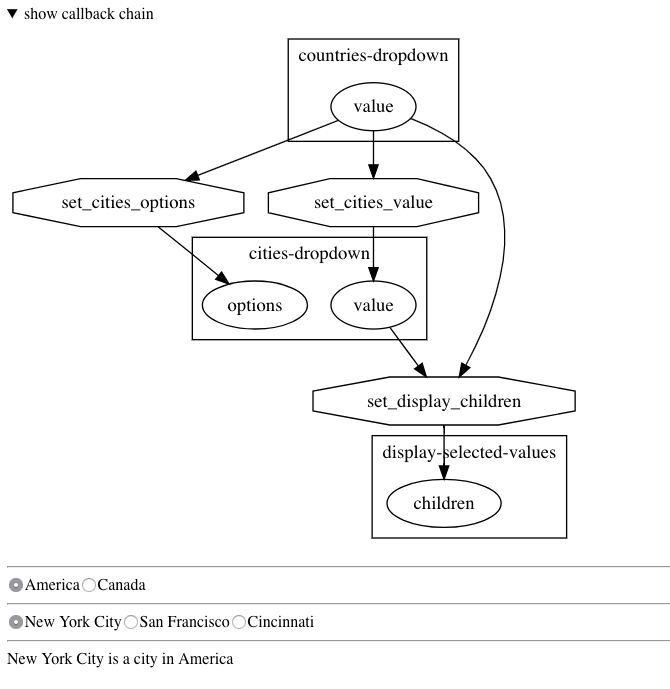

# dash-callback-chain (ALPHA QUALITY)

Dash component to visualize callback chains

## Example

The [simple example app in this repo](usage.py) has two linked radio button groups and the chain visualization looks like this:



## Usage

Install with `pip install dash_callback_chain`

```python
import dash_callback_chain as chainvis

app.layout = html.Div([
    chainvis.CallbackChainVisualizer(id="chain"),
    #... your app ...
])

app.scripts.config.serve_locally = True


@app.callback( Output('chain', 'dot'), [Input('chain', 'id')] )
def show_chain(s): return chainvis.dot_chain(app, ["show_chain"])

# ... the rest of your app's callbacks
```
